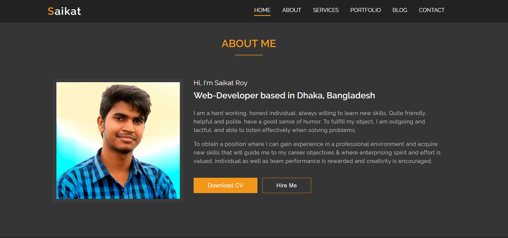

# Saikat Roy
> It's my personal portfolio website. Designed as static site as i'm hosting from git hub pages.



> Based on basically html, css and a littile bit of jquiry is used to create this page....

# Portfolio

## Features-

1. Animated Landing Page
2. Individual Section in single page as standard
3. Responsive, Always ready to show the best in any display size
4. Interactive animated options
5. Contact form
6. Location, Blogging Thumbnail and Portfolio Section included

**Using tools -**

- HTML
- CSS
- JavaScript
- jQuiry

## Designing Tools-
- Adobe Photoshop
- Figma
- Adobe XD

## Dev Tools-
- VS Code
- Git

**HTML SAMPLE**

```HTML
    <!--About Start-->
    <section class="about" id="about">
        <div class="container">
            <h2 class="title">About Me</h2>
            <div class="about-content">
                <div class="img">
                    

                </div>
                <div class="description">
                    <h4>Hi, I'm Saikat Roy</h4>
                    <h5>Web-Developer based in Dhaka, Bangladesh</h5>
                    <p>
                        I am a hard working, honest individual, always willing to learn new skills. Quite friendly,
                        helpful and polite, have a good sense of humor.
                        To fulfill my object, I am outgoing and tactful, and able to listen effectively when solving
                        problems.
                    </p>
                    <p>
                        To obtain a position where I can gain experience in a professional environment and acquire new
                        skills that will guide me to my career objectives & where
                        enterprising spirit and effort is valued, individual as well as team performance is rewarded and
                        creativity is encouraged.

                    </p>
                    <p>
                        <button type="button" class="btn-bg"><a href="./resume/CV-Saikat_Roy.pdf" download>Download
                                CV</a></button>
                        <button type="button" class="btn-light"><a href="#contact">Hire Me</a></button>
                    </p>

                </div>
            </div>
        </div>
    </section>
```

**CSS SAMPLE**

```CSS
header.sticky {
  position: fixed;
  background-color: #222222;
  animation: header 0.5s ease;
}
@keyframes header {
  0% {
    transform: translateY(-100%);
    opacity: 0;
  }
  100% {
    transform: translateY(0%);
  }
}
header .logo {
  float: left;
}
header .logo a {
  font-size: 30px;
  display: inline-block;
  padding: 5px 0px;
  color: #ffffff;
  font-weight: 600;
  letter-spacing: 2px;
}

```

> Contact With Developer:

### Saikat Roy

> Email: njmsaikat@gmail.com

> Personal Portfolio: https://njmsaikat.github.io/saikat/

> Linked In Profile: https://www.linkedin.com/in/njmsaikat/

# Full Page View


